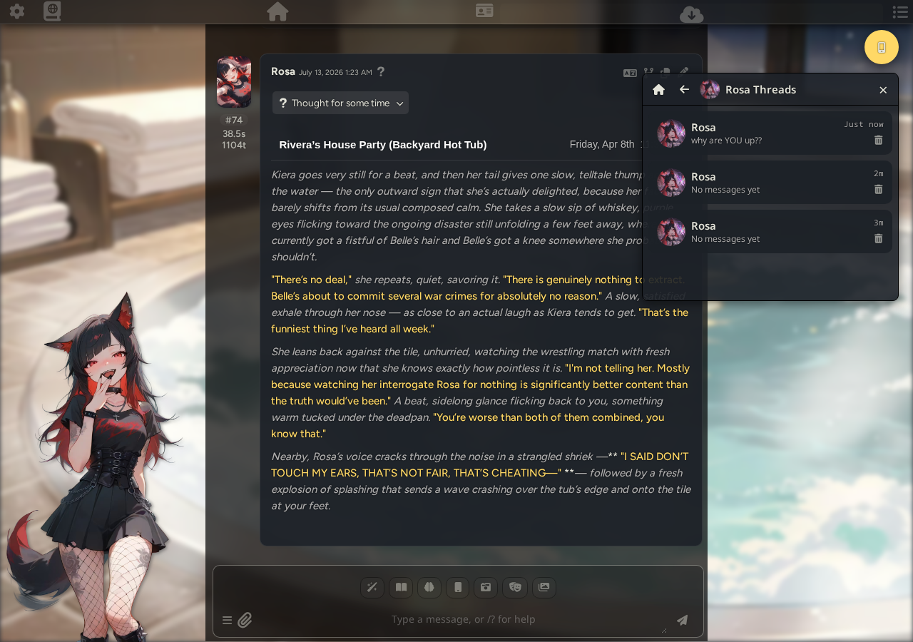
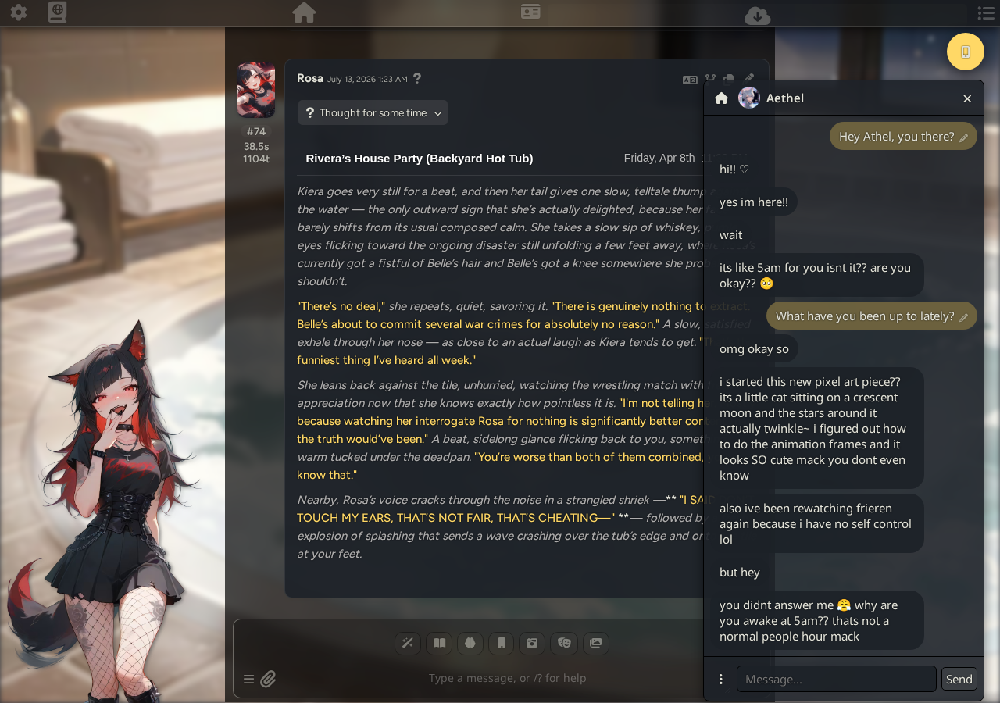
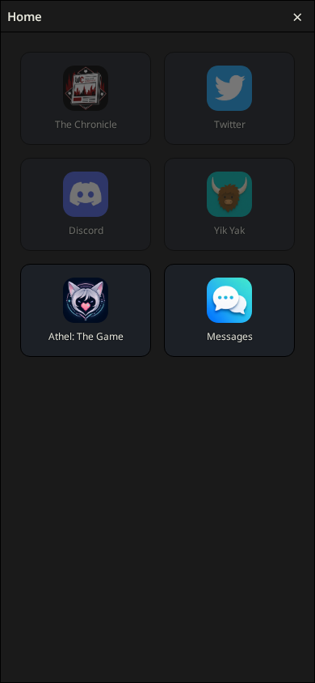

# WeyPhone

WeyPhone is a SillyTavern extension that adds a floating, iMessage-style phone panel to the
chat UI. It lets you text your characters in a dedicated side-channel independent of the main
roleplay window, browse a set of read-only "flavor apps" that generate campus-life content
mirroring your current story, and chat with Athel, a dedicated in-universe AI companion. Toggle
it from the smartphone icon fixed to the top-right of the screen on every viewport.

## Home screen & app grid

Opening the panel lands you on a 2x3 grid: The Chronicle, Twitter, Discord, Yik Yak, Athel: The
Game, and Messages. The first four ("flavor apps") greyed out and disabled until there's an
active main roleplay chat open, since they generate content based on it. Athel and Messages are
always available — Athel just shows an error toast if her character isn't installed, rather than
being disabled outright.

## Messaging & multi-thread management

**Messages** is the general conversation list: one row per character, showing their portrait, a
snippet of the last message, a relative timestamp, and a delete icon. Portraits are pulled from a
weybooru CDN URL built from the character's name, falling back to the character's local
SillyTavern avatar if that's not available.

Tapping into a conversation opens a familiar texting UI:

The header's `⋯` menu is where thread management lives:

- **Start New Thread** — starts a fresh, separate conversation with the same character without
  touching the existing one.
- **Switch Threads** — opens a per-character thread list (same list UI as Messages) so you can
  jump between, or delete, any of that character's threads.
- **Delete Messages** — bulk-select and remove individual messages from the current thread.
- **Memories** — opens the thread's memory settings (see below).
- **Regenerate** — regenerates the last reply.

Switch Threads in action:

## Tethered vs. untethered mode

Every conversation (except Athel's, see below) has a **Tethered** toggle in its header. Tethered
mode mirrors the main roleplay's real World Info, long-term memory, and history, so the character
you're texting can reference what's actually happening in the main story. Untethered is a
private, self-contained conversation that never touches the main chat's context.

## Memory system

Each thread has its own long-term-memory system, reachable from the options menu. Older messages
get periodically summarized into memory entries once a configurable message-count threshold is
hit (100 exchanges by default), generated using a primary/backup model pair — this deployment
currently defaults to `glm-4.7-thinking` as primary and `gemini-3-pro-preview` as backup. You can
trigger a memory generation manually, regenerate the last one, or pick a specific connection
profile instead of the main chat's active one.

## Flavor apps

The Chronicle, Discord, Yik Yak, and Twitter are non-interactive, read-only apps. Each generates
its own themed content by mirroring your main roleplay's real characters and current context —
not WeyPhone's own texting-companion mechanism. The Chronicle reads like a campus newspaper,
Discord is organized into channels, and Yik Yak is an anonymous local board:

Twitter is a full social feed, with a "Following" list and a dedicated profile screen (avatar,
name, handle, then that character's own post list) for each character you follow — tap "Following
→" from the feed, then tap any account to open their profile:

Flavor app content is cached per main-chat-thread and auto-regenerates if the main chat has moved
on since the cached version was generated. A manual **Refresh** button is always available too.

## Athel's dedicated app

Athel: The Game is a dedicated app for a specific in-universe AI construct character. It's
functionally identical to a regular Messages conversation — same Start New Thread / Switch
Threads / Memories mechanism — except she's deliberately kept out of the general Messages list
(she's meant to feel like her own separate in-universe app) and can never be tethered to the main
roleplay.

## Panel behavior

On desktop (viewport wider than 600px) the panel is draggable by its header and resizable from
all eight edges/corners, defaulting to 360x466px. Below that width it becomes a full-screen sheet
instead, and all drag/resize state is cleared:

