# WeyPhone

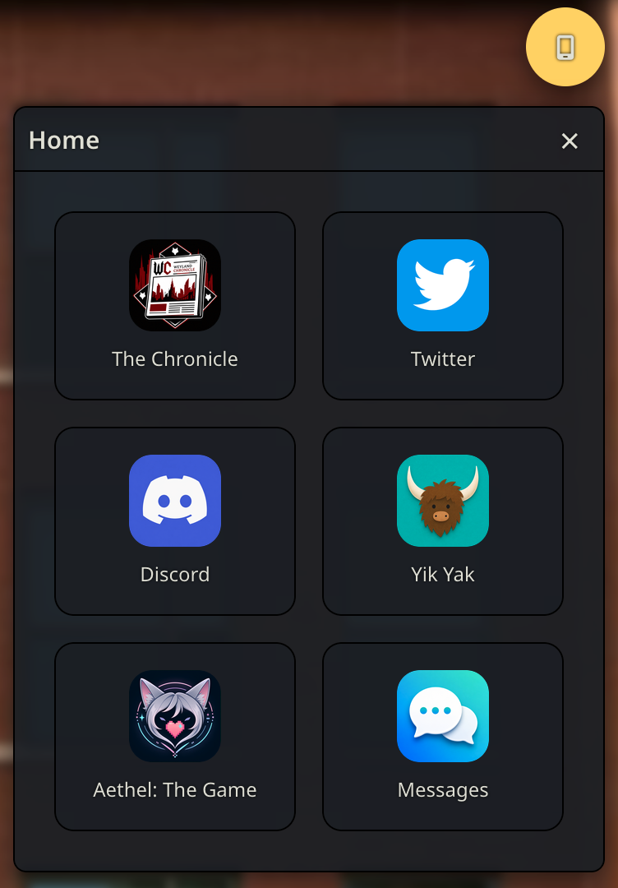

WeyPhone drops a fully-functional phone into your pocket during any Weyland Tavern roleplay —
text your characters in a private side-channel, browse a handful of campus-life social apps that
write themselves around your story, and keep it all in a floating panel you can drag, resize, or
pop full-screen on mobile.

<table>
<tr>
<td><a href="assets/screenshots/messages-list.png">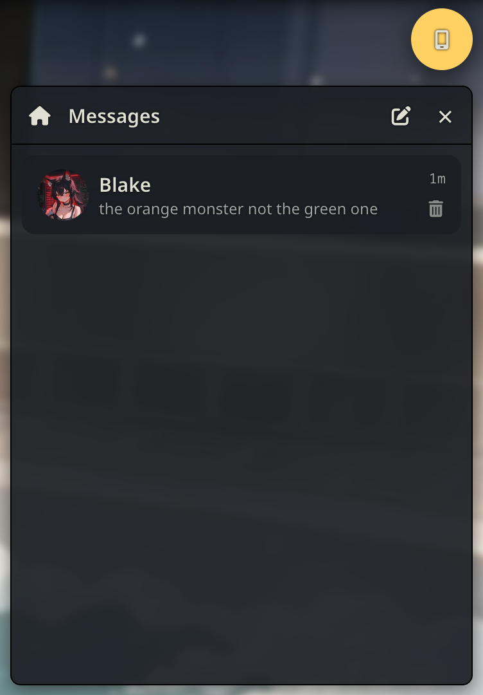</a></td>
<td><a href="assets/screenshots/conversation.png">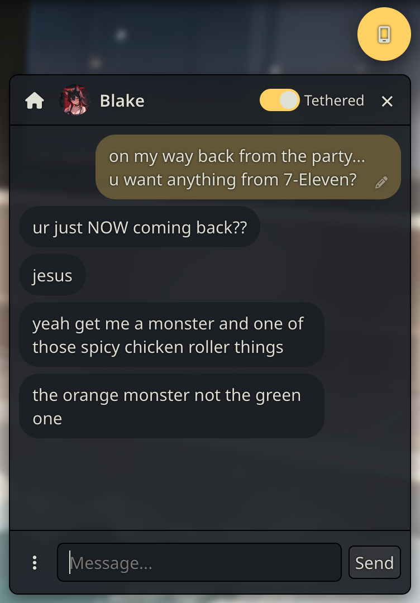</a></td>
<td><a href="assets/screenshots/conversation-options-menu.png">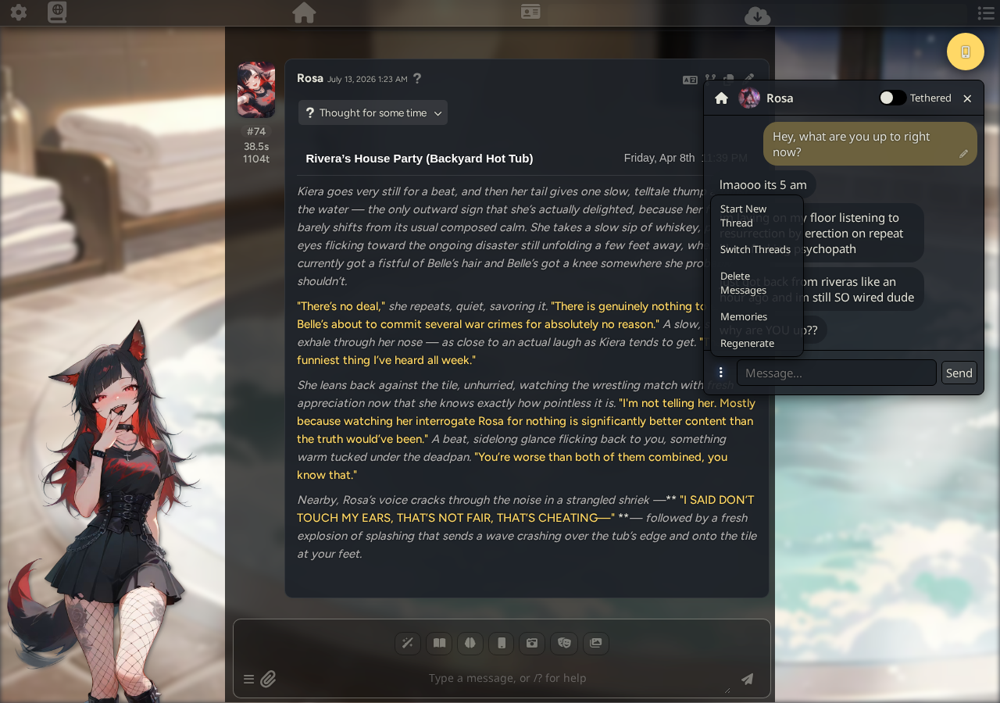</a></td>
<td><a href="assets/screenshots/memories.png">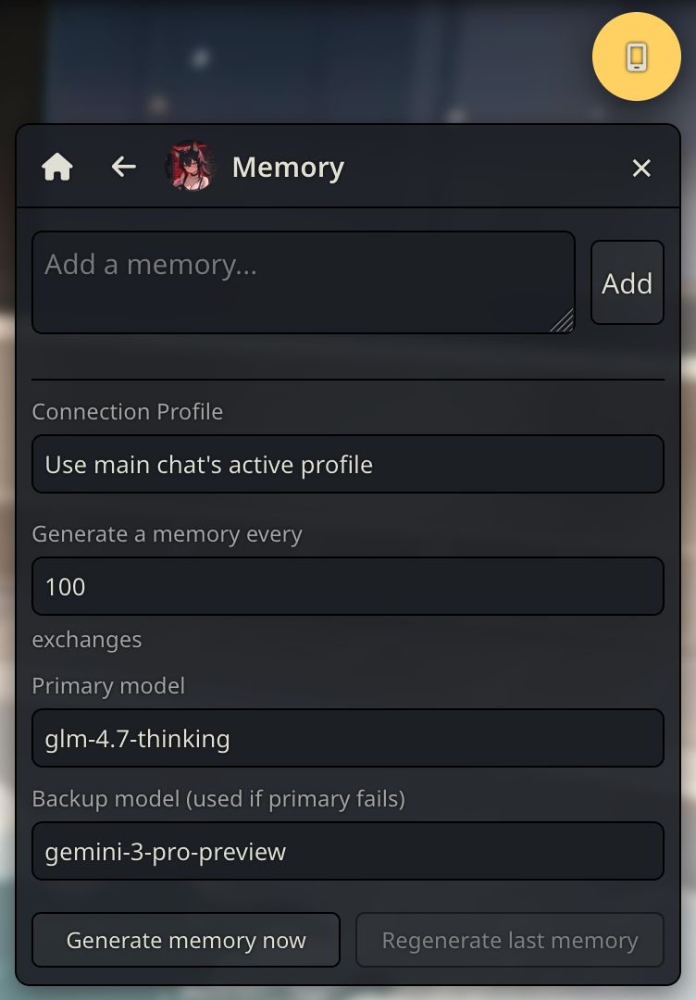</a></td>
<td><a href="assets/screenshots/chronicle.png">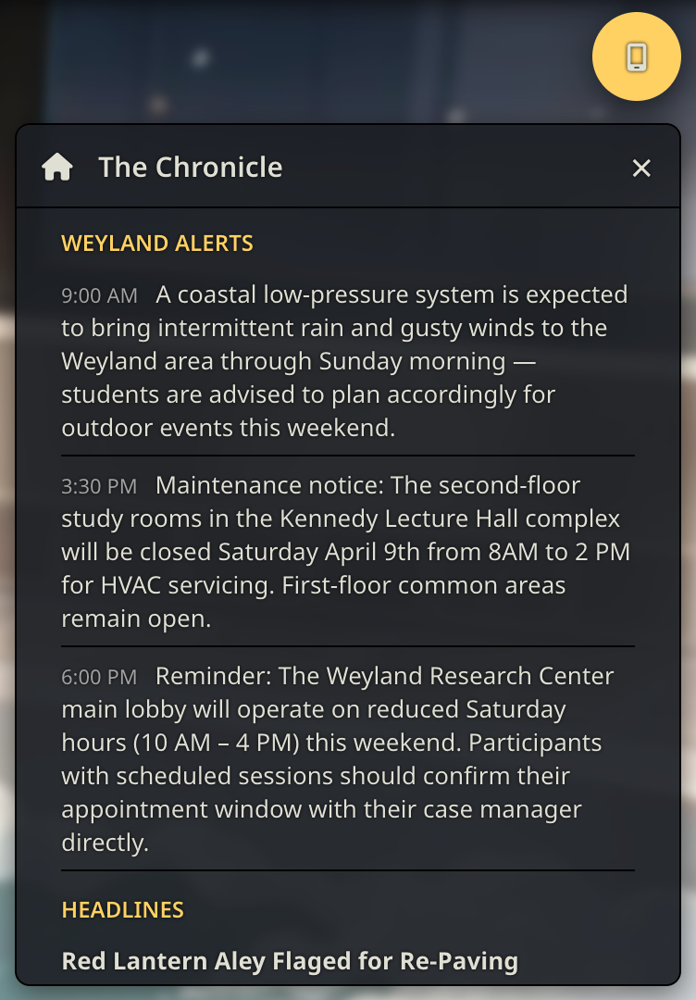</a></td>
</tr>
<tr>
<td><a href="assets/screenshots/discord.png">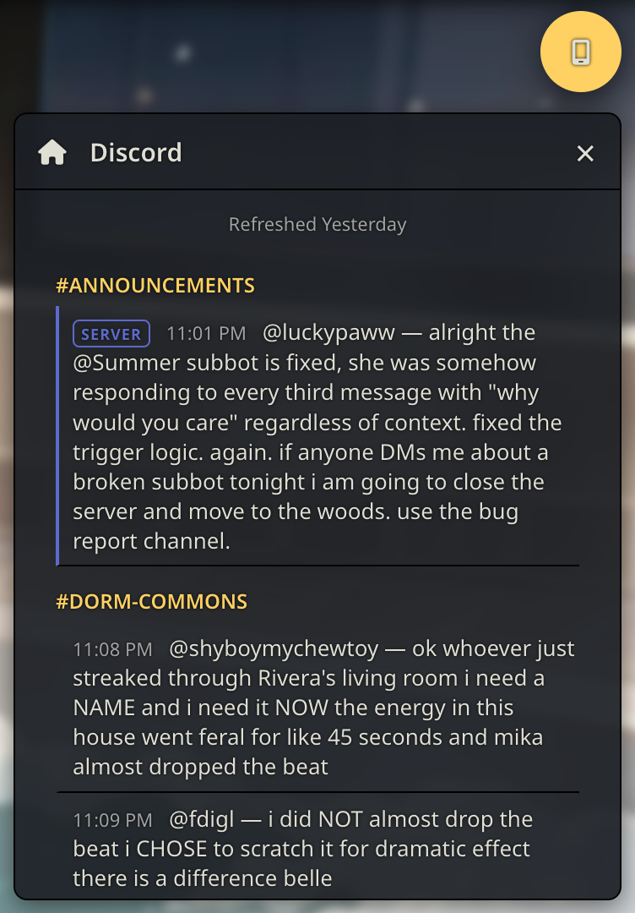</a></td>
<td><a href="assets/screenshots/yikyak.png">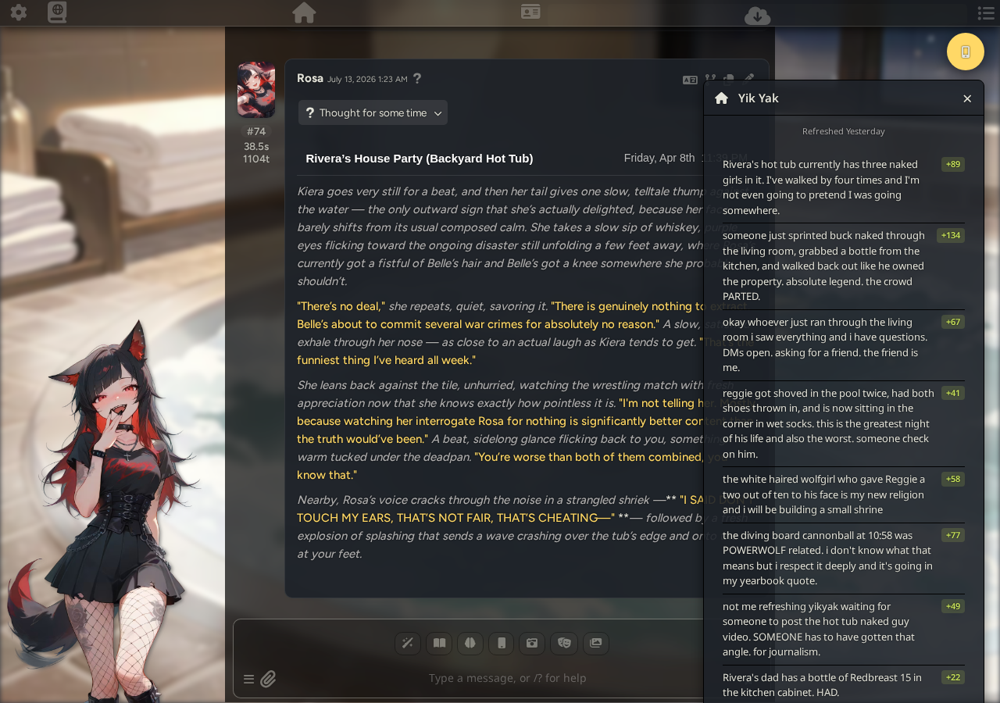</a></td>
<td><a href="assets/screenshots/twitter-feed.png">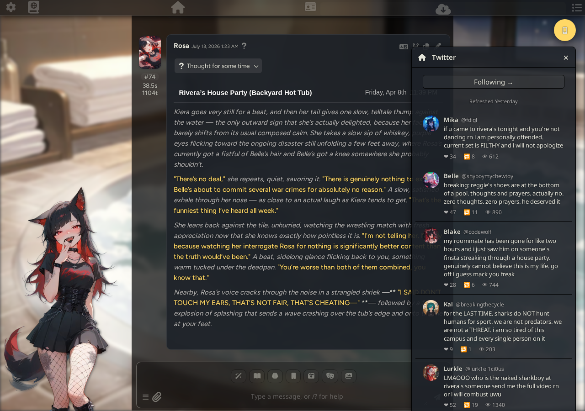</a></td>
<td><a href="assets/screenshots/twitter-following.png">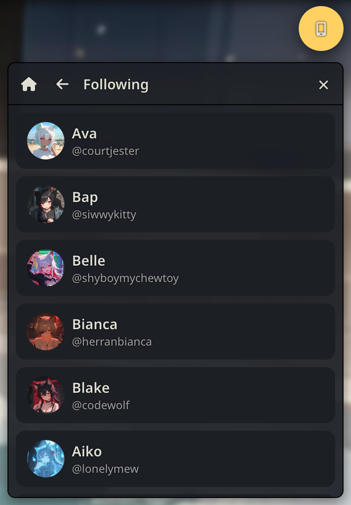</a></td>
<td><a href="assets/screenshots/twitter-profile.png">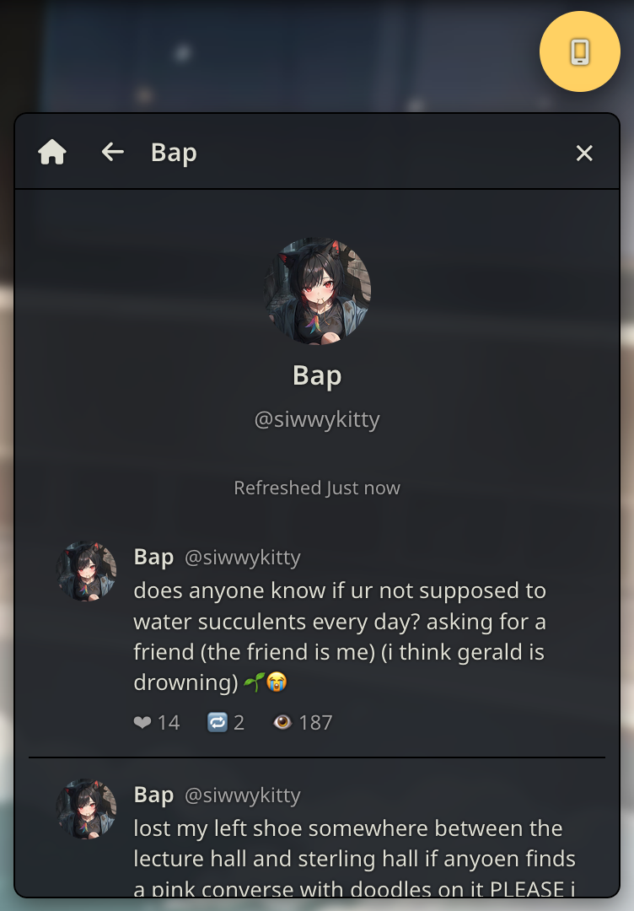</a></td>
</tr>
</table>

## Apps

- **Messages** — Text anyone, anytime. Every character in your roster, one tap away.
- **Weyland Chronicle** — The city and the university, held to account, one headline at a time.
- **Twitter** — Everyone's already posting. Follow your favorites, or just watch the timeline burn.
- **Discord** — Every server has that one channel. Drop into the chaos, channel by channel.
- **Yik Yak** — Hyperlocal and completely unfiltered. Nobody knows who's posting. Everybody has a guess.
- **Aethel: The Game** — Meet Aethel, living in her own dedicated app — right where she belongs.

## Features

- Multiple messaging threads per character — start a fresh one anytime, switch back whenever,
  delete what you don't need.
- Built-in memory system — long conversations get summarized automatically so nothing's forgotten.
- Tether or untether — mirror the main roleplay's world, history, and memories live, or keep a
  conversation fully private.
- Flavor apps write themselves around your story and stay fresh as it moves on.
- Character portraits resolve automatically — no setup required.
- Draggable, resizable panel on desktop; clean full-screen sheet on mobile.
